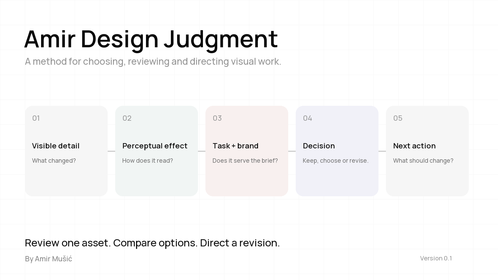

# Amir Design Judgment

A portable method for reviewing visual work, choosing between options and directing the next revision. By **Amir Mušić**.

**[Download SKILL.md](https://github.com/amirmushichge/amir-design-judgment/releases/latest/download/SKILL.md)** · **[Read the method](SKILL.md)**

## The idea

A useful critique connects what you can see to what the work needs to do:

**Visible detail → perceptual effect → fit with the task and brand → decision → next action.**

Look at the whole, inspect the details that could change the decision, then return to the whole. Explain why an option is worth choosing and what still needs fixing.

## Use it

Download `SKILL.md` and give it to a vision-capable assistant as an attached instruction file or project context. Supply your asset, purpose, audience, intended viewing size and any brand rules.

For an agent with a skill system, place the file in its supported skill directory. In Codex, for example, use `~/.agents/skills/amir-design-judgment/SKILL.md`. Other agents have their own installation conventions. The Markdown method can also be used directly without a skill loader.

The assistant needs access to the work. For motion, supply a playable video or frame sequence; one still only supports a still-image review. The file does not install a video viewer or add new tool capabilities.

### Try it

**Review one design**
```text
Use Amir Design Judgment to review this poster for a mobile feed.
The aim is to communicate [message] to [audience].
Here are the brand rules. What should I keep, and what should I change first?
```

**Choose between options**
```text
Compare these three assets using Amir Design Judgment.
Choose one for [purpose]. Show the deciding detail, the tradeoff,
and the changes needed before delivery. My budget is [constraint].
```

**Direct a revision**
```text
Review this revision against the previous version and our brief.
Did the changes solve the main problem? Did they weaken anything else?
Give me the next three actions in priority order.
```

## Version 0.1

This first version distils Amir's recorded design reviews and documented decisions into one instruction file. It covers composition, typography, image craft, brand expression and motion. It is strongest in those areas; specialised disciplines need their own context.

It is an initial documented method, not a guarantee of Amir's personal verdict. Results depend on the assistant, the supplied evidence and the brief. Independent performance validation remains future work. No API keys, scripts or project-specific references are required.

## Help it improve

Open an issue with the brief, the assets you can share, the review and the decision you disagree with. Concrete comparisons are useful evidence for the next version. New versions can incorporate further reviews while keeping the core file portable.

Shared under **[CC BY 4.0](LICENSE)**. Credit **“Amir Design Judgment by Amir Mušić”**, link to this repository and identify changes. Attribution does not imply Amir's endorsement.
